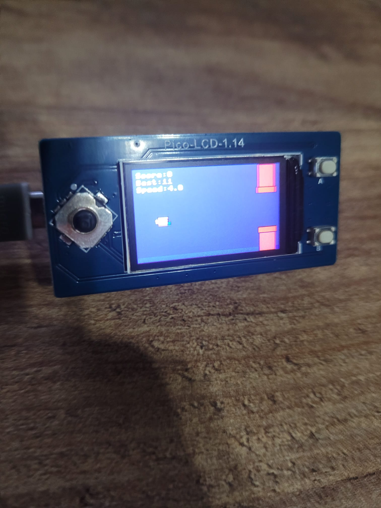

# 🎮 Scorpion GameBoy: Flappy Bird on Raspberry Pi Pico

A lightweight, fun, and responsive **Flappy Bird** clone developed for the Raspberry Pi Pico using a **1.14-inch ST7789 LCD**. This project is part of the Scorpion GameBoy series, focusing on efficient MicroPython game development.

## 🚀 Features
- **Hardware Optimized:** Written in pure MicroPython for the RP2040.
- **Fast Graphics:** Uses a custom ST7789 driver with frame buffering to prevent flickering.
- **Classic Gameplay:** Physics-based bird movement, gravity, and random pipe generation.
- **Simple Controls:** Dedicated jump button (Button B) for an authentic arcade feel.

---

## 🛠️ Hardware Requirements
| Component | Specification |
| :--- | :--- |
| **Microcontroller** | Raspberry Pi Pico (RP2040) |
| **Display** | 1.14" LCD (ST7789 Driver, 240x135) |
| **Button** | Momentary Push Button (for Jump) |
| **Connection** | Jumper Wires / Breadboard |

### 📌 Pin Configuration
| LCD Pin | Pico Pin | Function |
| :--- | :--- | :--- |
| **VCC** | 3.3V | Power |
| **GND** | GND | Ground |
| **SCK** | GP10 | SPI Clock |
| **MOSI** | GP11 | SPI Data |
| **CS** | GP9 | Chip Select |
| **DC** | GP8 | Data/Command |
| **RST** | GP12 | Reset |
| **Button B** | GP2 | Jump Input |

---

## 📂 Project Structure
* `main.py`: The entry point. Handles the menu and game initialization.
* `flappy.py`: The core game logic (physics, collisions, rendering).
* `st7789.py`: Optimized display driver with 240x135 offset support.

---

## ⚙️ Installation
1.  **Flash MicroPython:** Ensure your Raspberry Pi Pico is running the latest MicroPython firmware.
2.  **Upload Files:** Use **Thonny IDE** to upload all `.py` files to your Pico.
3.  **Run:** Power the Pico and press **Button B** to start flapping!

---

## 🕹️ Controls
- **Button B (GP2):** Jump / Flap Wings.
- **Button A (GP3):** Used in the main menu to select games (if integrated).

---

## 👨‍💻 Author
**Scorpion / Machaa_**
* GitHub: [@dav4bb](https://github.com/dav4bb)
* Check out my other projects like Scorpion AI and Machaa_ PC on Mobile.

---

## 📜 License
This project is open-source and available under the [MIT License](LICENSE).
